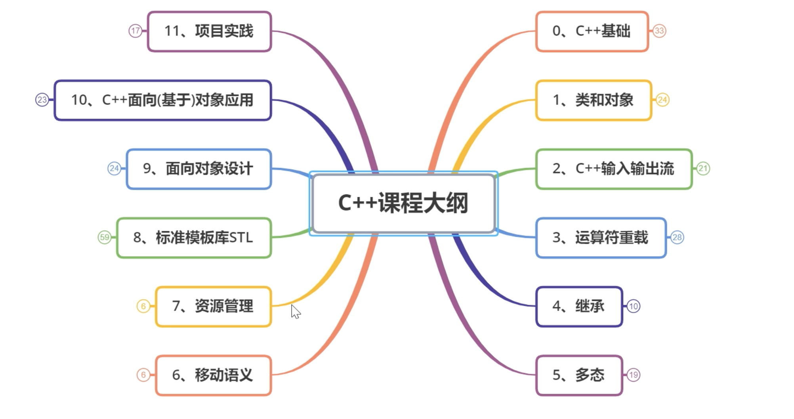
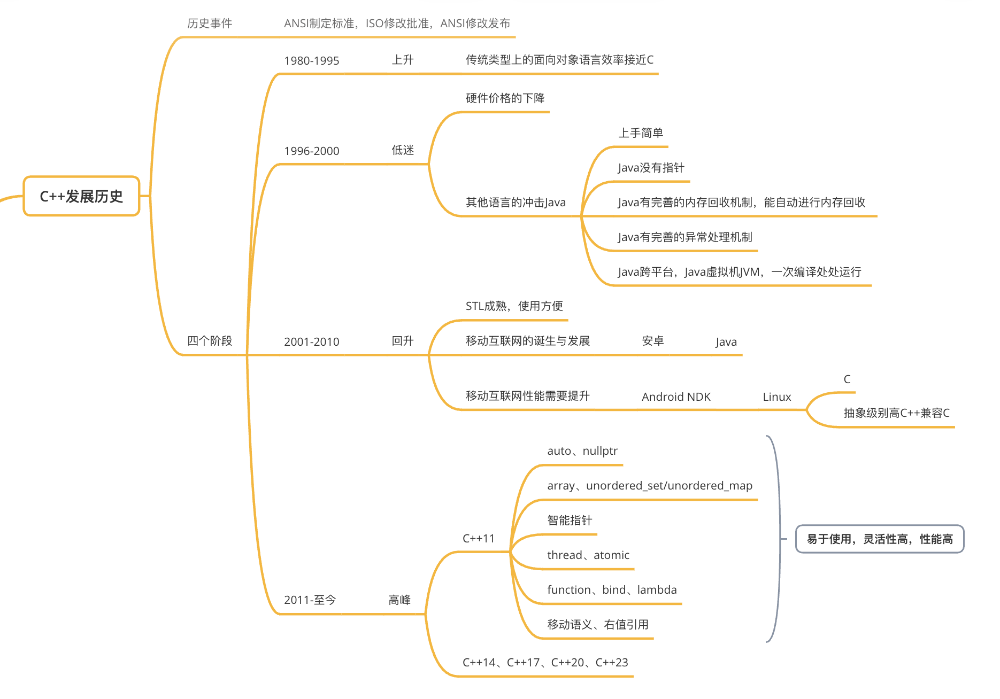
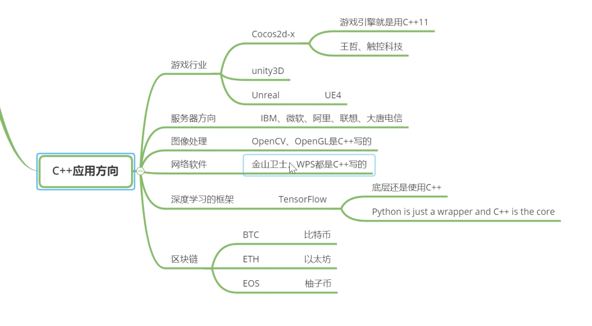

## 概览


## day1知识点
### c++发展历史
诞生的直接原因：Bjarne博士在研究Unix内核时，发现没有合适的工具可以有效的分析由于内核分布而造成的网络流量以及如何将内核模块化

### c++应用方向

### 命名空间
```c++
/* 
// 为了避免不经意间的名称冲突，让重复名称被正确管理，创造了命名空间
正确使用命名空间，我们有三种方法：
    1. 将命名空间写完整，处处使用std::cout,std::endl;
    2. 靠经验使得不冲突(不可靠)
    3. 使用一个写一个命名空间：using std::cout;

命名空间有一些自己的特性：
    1. 可以嵌套使用，namespace nice{namespace nice {}}
    2. 可以扩展，比如你可以给std空间增加内容而不会报错（但很容易冲突）。为防止报错，一般不扩写。系统命名空间一般都是小写。
    3. 就近覆盖
    4. 在命名空间中，我们可以定义变量、函数、结构体、命名空间，统称为实体
    5. ::  叫做“作用域限定符”
*/

// 1. 嵌套
namespace test {
    namespace test {
        void TestNameSpace();
    }
}

// 2. 追加
namespace std {
    void MyStdFunc() {
        std::cout << "My std Funct" << std::endl;
    }
}

// 3. 就近覆盖
// 全局变量 print
int print = 10;

namespace OverWrite {
    int print = 20;
    void test(int print = 1) {
        std::cout << "形式参数 print = " << print << std::endl;
        std::cout << "命名空间内的 print = " << OverWrite::print << std::endl;
        std::cout << "全局变量 print = " << ::print << std::endl;
    }
}
```
### const关键字
```c++
/****

常量修饰符，这里我们需要区分两个内容**指针常量**和**常量指针**

核心区分方式：从右往左读。
    const 修饰的是它左边的内容（如果左边有东西的话），如果左边没有东西，则修饰右边：

1. *常量指针 (pointer to const)*：const int *p 或 int const *p
    1. 读法：p 是一个指针，指向 const int
    2. 含义：指向的值不能改，指针本身可以改
    3. *p = 10; ❌ | p = &b; ✅

2. *指针常量 (const pointer)*：int * const p
    1. 读法：p 是一个 const 指针，指向 int
    2. 含义：指针本身不能改，指向的值可以改
    3. *p = 10; ✅ | p = &b; ❌
    4. 组合：const int * const p — 都不能改

* 和运算符优先级无关。 区别完全取决于 const 相对于 * 的位置，跟优先级规则没有直接关系。
* 运算符优先级影响的是带解引用的表达式求值顺序（如 *p++ vs (*p)++），而不是类型声明本身的语义。
* 类型声明遵循的是 C/C++ 的"声明模仿使用"（declaration mimics use）语法规则。


> 中文区分：从左往右读
* const : 指针常量
const * : 常量指针

> 英文区分：从右往左读
* const : a const pointer
const * : a pointer to const

****/

#include <iostream>

using std::cout;
using std::endl;

//宏定义发生的时机是在预处理阶段,字符串替换,有bug会到运行时才会发现
#define MAX 10
#define multiply(x, y) ((x) * (y))


void test()
{
    //发生时机在编译阶段,会进行类型安全检查,如果有bug在编译时候就会出现
    //内置类型：char/short/int/long/double/float/void *
    const int number = 10;//const修饰的变量称为常量，必须在定义的时候进行初始化
    /* number = 20;//赋值,常量不能进行赋值 */

    int const number2 = 20;
}

//函数指针           指针函数
//int (*pf)(int)     int*   pf(int)
//
//数组指针           指针数组
//int (*pArray)[]    int* pArray[]

void test2()
{
    int value = 2;
    int value1 = 10;
    int *p1 = &value1;
    p1 = &value;
    *p1 = 20000;

    cout << endl;
    int value2 = 200;
    const int *p2 = &value2;//当const位于*左边的时候，常量指针(pointer to const)
    /* *p2 = 222;//error,不能修改指针所指变量的值 */
    p2 = &value;//ok,可以改变指针本身（指向）

    cout << endl;
    int value3 = 300;
    int const *p3 = &value3;//当const位于*左边的时候，常量指针(pointer to const)
    /* *p3 = 333;//error,不能修改指针所指变量的值 */
    p3 = &value;//ok,可以改变指针本身（指向）

    cout << endl;
    int value4 = 400;
    int * const p4 = &value4;//当const位于*右边的时候，指针常量(const pointer)
    *p4 = 444;//ok,可以修改指针所指变量的值
    /* p4 = &value;//error,不可以改变指针本身（指向） */

    cout << endl;
    int value5 = 500;
    const int * const p5 = &value5;//双const
    /* *p5 = 555;//error,不可以修改指针所指变量的值 */
    /* p5 = &value;//error,不可以改变指针本身（指向） */
}
int main(int argc, char **argv)
{
    test2();
    return 0;
}
```

### new和delete
new/delete与malloc/free的区别是什么?
```c++
#include <stdlib.h>
#include <string.h>
#include <iostream>

using std::cout;
using std::endl;

void test2()
{
    int number = 10;
    printf("sizeof(number) = %lu", sizeof(number));
    printf("sizeof number = %lu", sizeof number);//sizeof是一个运算符
}
//面试中常问的
//内存溢出？踩内存？内存越界？野指针
//
//
//面试题
//malloc/free与new/delete异同点？
//1、都是用来申请堆空间的
//2、malloc与free，new与delete要成对出现，否则可能造成内存泄漏
//
//不同点：
//1、malloc/free是C里面的库函数，new/delete是C++中的表达式
//2、malloc申请的是未初始化的堆空间，new申请是已经初始化的堆空间

void test()
{
    int *pInt = (int *)malloc(sizeof(int));//1、申请堆空间
    memset(pInt, 0, sizeof(int));//2、初始化
    *pInt = 10;//3、赋值

    free(pInt);//4、释放堆空间
    /* pInt = NULL;//0 */
    pInt = nullptr;//void *

    int *pArray = (int *)(malloc(sizeof(int) * 10));
    memset(pArray, 0, sizeof(int) * 10);

    free(pArray);
    pArray = nullptr;
}

void test3()
{
    int *pInt = new int(10);//1、申请堆空间，并初始化，还可以进行赋值
    cout << "*pInt = " << *pInt << endl;

    delete pInt;//2、释放堆空间
    pInt = nullptr;

    int *pArray = new int[10]();
    pArray[0] = 120;

    delete [] pArray;
}
int main(int argc, char **argv)
{
    cout << "Hello world" << endl;
    return 0;
}


```


### 引用的使用


```c++
// 引用就是对指针解引用的语法糖(甜的，用起来舒服就是甜的)。
// 为了减少指针的使用，创造了引用这个用起来甜甜的功能。
// 引用本身就是别名
int a = 0
// 下面两句在汇编代码中完全相同
int &r = a;
int *p = &a;

#include <iostream>

using std::cout;
using std::endl;

//指针与引用的异同点？
void test()
{
    int number = 10;
    int &ref = number;//引用是变量的别名,引用的提出就是为了减少指针的使用
    &ref;
    cout << "number = " << number << endl;
    cout << "ref = " << ref << endl;
    printf("number = %p\n", &number);
    printf("ref = %p\n", &ref);

    cout << endl;
    int number2 = 200;
    ref = number2;//操作引用与操作变量本身是一样的
    cout << "number2 = " << number2 << endl;
    cout << "number = " << number << endl;
    cout << "ref = " << ref << endl;
    printf("number2 = %p\n", &number2);
    printf("number = %p\n", &number);
    printf("ref = %p\n", &ref);

    cout << endl;
    //引用的实质：指针常量 * const

    //引用不能独立存在，在定义的时候必须要进行初始化,在定义的
    //的时候绑定到变量上面，跟变量绑定到一起，不会改变引用的指向
/*    int &ref2;   ERROR */
}

//1、引用作为函数参数
#if 0
//值传递====副本
//没有触及a b本身
void swap(int x, int y)//int x = a, int y = b
{
    int temp = x;
    x = y;
    y = temp;
}
#endif
#if 0
//值传递====地址值
void swap(int *px, int *py)//int *px = &a, int *py = &b;
{
    int temp = *px;
    *px = *py;
    *py = temp;
}
#endif
//引用传递====变量本身
void swap(int &x, int &y)//int &x = a, int &y = b
{
    int temp = x;
    x = y;
    y = temp;
}

void test2()
{
    int a = 3, b = 4;
    cout << "在交换之前 a = " << a << ", b = " << b << endl; 
    swap(a, b);
    cout << "在交换之后 a = " << a << ", b = " << b << endl; 
}

//2、引用作为函数返回类型

int func1()
{
    int number = 10;
    return number;//执行一个拷贝操作
}

int &func2()
{
    int number = 10;//局部变量
    return number;//不能返回一个局部变量的引用
}

//不要去返回堆空间的引用,必须要有内存回收的机制
int &getHeapData()
{
    int *pInt = new int(100);

    return *pInt;
}

void test4()
{
    int a = 3, b = 5;
    int temp = a + getHeapData() + b;
    cout << "temp = " << temp << endl;

    int &ref = getHeapData();
    delete &ref;
}

//函数返回类型是引用的前提:实体的生命周期一定要大于函数的生命周期
int arr[10] = {1, 3, 5, 7, 9, 10};
int &getIndex(int idx)
{
    return arr[idx];//先不去考虑越界
}

void test3()
{
    cout << "getIndex(0) = " << getIndex(0) << endl;
    getIndex(0) = 200;
    cout << "getIndex(0) = " << getIndex(0) << endl;
    cout << "arr[0] = " << arr[0] << endl;
    
    /* func1() = 200; */
}
int main(int argc, char **argv)
{
    test4();
    return 0;
}
```


## Day1作业


 C++Day1

C++语法规则很多，要落实下来，得通过多敲代码来理解，看N遍不如写一次；在写代码的过程中，会碰到其它你不曾碰到过的编译问题，切记程序是调试出来的；再就是通过练习，把敲代码的速度提升上来，熟悉键盘，培养写代码的感觉


### 一、选择题
1、在C++中执行以下4条语句后输出rad值为：（）

```C++
static int hot=200; 
int &rad=hot;
hot = hot + 100; 
cout<< rad << endl; 

A、100        B、200     C、300    D、400
```


### 二、简答题

1. const关键字与宏定义的区别是什么？
2. malloc的底层实现是怎样的？free是怎么回收内存的？
3. new/delete与malloc/free的区别与联系是什么？(面试常考)
4. 区分以下概念：内存泄漏、内存溢出、内存踩踏、野指针？(面试常考)
5. 引用与指针的区别是什么？并且将"引用"作为函数参数有哪些特点？在什么时候需要使用"常引用"？


### 三、写出下面程序的运行结果。

1、第一题：

```C++
#include <iostream>

using std::cout;
using std::endl;

void f2(int &x, int &y) 
{
	int z = x; 
	x = y; 
	y = z;
}

void f3(int *x, int *y) 
{
	int z = *x; 
	*x = *y; 
	*y = z;
}

int main() 
{
	int x, y;
	x = 10; y = 26;
	cout << "x, y = " << x << ", " << y << endl;
	f2(x, y);
	cout << "x, y = " << x << ", " << y << endl;
	f3(&x, &y);
	cout << "x, y = " << x << ", " << y << endl;
	x++; 
	y--;
	f2(y, x);
	cout << "x, y = " << x << ", " << y << endl;
	return 0;
}
```


2、以下代码输出的是__？

```C++
int foo(int x,int y)
{
    if(x <= 0 ||y <= 0)  
        return 1;
    return 3 * foo(x-1, y/2);
}

cout << foo(3,5) << endl;
```


3、若执行下面的程序时，从键盘上输入5，则输出是（）

```C++
int main(int argc, char** argv)
{
    int x;
    cin >> x;
    if(x++ > 5)
	{
		cout << x << endl;
	}      
    else
	{
		cout << x-- << endl;
	}
    
    return 0;
}
```


4、写出下面程序的结果：

```C++
int main() 
{ 
    int a[5]={1,2,3,4,5}; 
    int *ptr=(int *)(&a+1); 
    printf("%d,%d",*(a+1),*(ptr-1)); 
}
```


### 四、有段代码写成了下边这样，如何在只修改一个字符的前提下，使代码输出20个hello?

```C++
for(int i = 0; i < 20; i--)
    cout << "hello" << endl;
```

