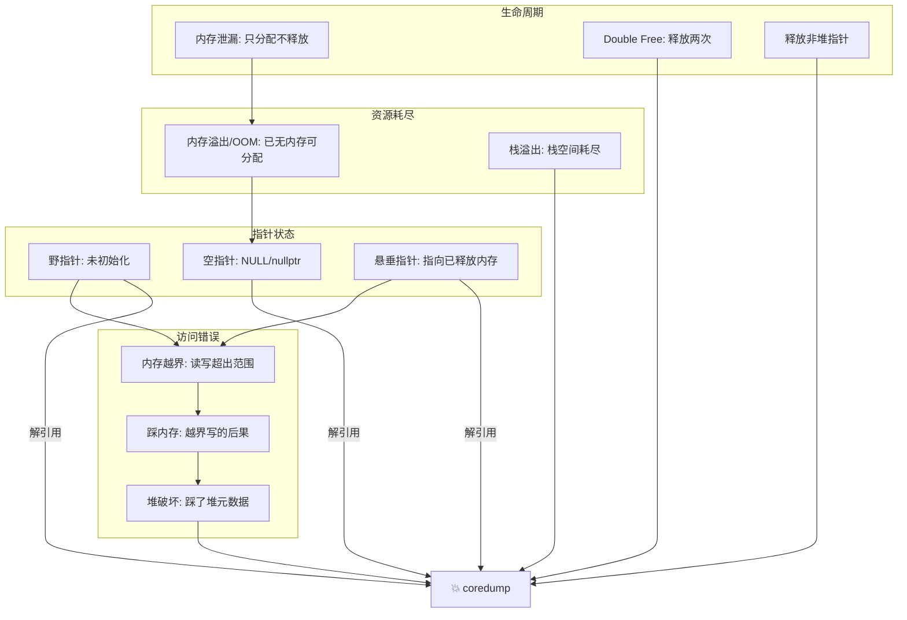

# C/C++ 指针与内存管理核心概念辨析

本文系统梳理 C/C++ 中指针相关的易混淆概念，覆盖类型声明、空指针规范、内存错误分类、防范手段、引用与指针差异、以及智能指针的最佳实践。

---

## 1. 常量指针 vs 指针常量

**核心区分方式：从右往左读。**

`const` 修饰的是它左边最近的内容；如果左边没有东西，则修饰右边的内容。

```cpp
const int *p;      // p 是"指针"，指向 "const int" → 指向的值只读
int const *p;      // 同上，完全等价

int * const p;     // p 是"const 指针"，指向 "int" → 指针本身只读

const int * const p; // 两者都只读：p 不可改，*p 也不可改
```

| 类型 | 声明 | 常量是谁 | 指向的值可改？ | 指针本身可改？ |
|---|---|---|---|---|
| 常量指针 (pointer to const) | `const int *p` 或 `int const *p` | 指向的内容 | ❌ | ✅ |
| 指针常量 (const pointer) | `int * const p` | 指针本身 | ✅ | ❌ |
| 两者都常 | `const int * const p` | 都是 | ❌ | ❌ |

```cpp
int a = 1, b = 2;

// 常量指针
const int *p1 = &a;
*p1 = 10;   // ❌ 编译错误：不能修改只读对象
p1 = &b;    // ✅ 指针本身可以改

// 指针常量
int * const p2 = &a;
*p2 = 10;   // ✅ 可以修改指向的值
p2 = &b;    // ❌ 编译错误：不能修改 const 指针

// 都常
const int * const p3 = &a;
*p3 = 10;   // ❌
p3 = &b;    // ❌
```

> **是否与运算符优先级有关？** 无关。区别完全取决于 `const` 相对于 `*` 的位置，类型声明的语法遵循的是 C/C++ 的"声明模仿使用"规则，而非表达式运算符优先级。

---

## 2. 函数指针 vs 指针函数、数组指针 vs 指针数组

**这里和运算符优先级直接相关。**

`[]` 和 `()` 的优先级高于 `*`，所以不加括号时，名字先和 `[]`/`()` 结合。

```cpp
// ── 数组指针 vs 指针数组 ──

int *arr[10];       // 指针数组：arr 是"有10个元素的数组"，每个元素是 int*
                    // [] 优先级更高 → arr 先跟 [10] 结合 → 是数组
                    // sizeof(arr) = 10 * sizeof(int*) = 80（64位）

int (*arr)[10];     // 数组指针：arr 是"指针"，指向"有10个int的数组"
                    // () 强制 arr 先跟 * 结合 → 是指针
                    // sizeof(arr) = sizeof(void*) = 8（64位）

// ── 函数指针 vs 指针函数 ──

int *func(int, int);    // 指针函数：func 是"函数"，参数两个int，返回 int*
                        // () 优先级更高 → func 先跟 (int,int) 结合 → 是函数

int (*func)(int, int);  // 函数指针：func 是"指针"，指向"两个int参数、返回int的函数"
                        // () 强制 func 先跟 * 结合 → 是指针
```

| 声明 | 本体是什么 | 指向/返回什么 | sizeof（64位） |
|---|---|---|---|
| `int *p[10]` | 数组 | 元素是 `int*` | 80 字节 |
| `int (*p)[10]` | 指针 | 指向 `int[10]` | 8 字节 |
| `int *f(int,int)` | 函数 | 返回 `int*` | — |
| `int (*f)(int,int)` | 指针 | 指向函数 | 8 字节 |

**简单记忆：不加括号的都是"XX数组"/"XX函数"（本体是数组/函数），加括号扣在 `*` 上的才是"数组XX"/"函数XX"（本体是指针）。**

---

## 3. 0 / void\* / NULL / nullptr

> [史上最明白的NULL、0、nullptr区别分析](https://www.cnblogs.com/porter/p/3611718.html)

### C 中的行为

| 符号 | 类型 | 行为 |
|---|---|---|
| `0` | 整数常量 | 可隐式转为 `void*` 作为空指针 |
| `NULL` | 通常 `(void*)0` 或 `0` | `void*` 或整数，取决于实现 |
| `void*` | 通用指针类型 | 可隐式转为任意指针（无需强转） |
| `nullptr` | C23 引入 | 尚不普及 |

### C++ 中的行为

| 符号 | 类型 | 行为 |
|---|---|---|
| `0` | 纯整数 | 传给指针参数时可隐式转换，但**优先匹配 `int` 重载** |
| `NULL` | 定义为 `0` 或编译器内置 `__null` | 本质上还是整数，**同样有重载歧义** |
| `nullptr` (C++11) | `std::nullptr_t` | 可隐式转为任意指针/成员指针，**不隐式转为整数** |
| `void*` | 通用指针类型 | **不能隐式转为其他指针**（和 C 不同），需强转 |

### 重载歧义演示

```cpp
void func(int);
void func(char*);

func(0);           // 调用 func(int) —— 可能不是期望的
func(NULL);        // 调用 func(int) —— 还是有问题
func(nullptr);     // 调用 func(char*) ✅ 精准匹配

// C vs C++ 的 void* 差异
char *p = malloc(16);  // C: ✅   C++: ❌ 编译错误
char *p = (char*)malloc(16);  // C++ 中需要强转
```

> **结论：C++ 标准 >= C++11 时，一律使用 `nullptr`。**

---

## 4. 内存泄漏与 coredump

### 内存泄漏

程序在堆上动态分配的内存，不再需要时没有释放，导致不可回收。随时间积累可能耗尽系统内存。

> [深入理解C++ new/delete, new \[\]/delete\[\]](https://www.cnblogs.com/tp-16b/p/8684298.html)

```cpp
// C
void leak_c() {
    int *p = (int*)malloc(100 * sizeof(int));
    // 忘了 free(p);  泄漏！
}

// C++
void leak_cpp() {
    int *p = new int[100];
    // 忘了 delete[] p;  泄漏！
}
```

### coredump（核心转储）的常见原因

进程收到特定信号后默认终止并 dump 核心映像，最常见的是 `SIGSEGV`、`SIGABRT`、`SIGBUS`。

| 原因 | 说明 | 示例 |
|---|---|---|
| 空指针解引用 | 对 `NULL`/`nullptr` 读写 | `int *p = nullptr; *p = 1;` |
| 野指针/悬垂指针 | 访问未初始化或已释放的指针 | `free(p); *p = 1;` |
| 数组越界 | 读写超出边界，破坏栈/堆 | `int a[10]; a[10] = 0;` |
| 栈溢出 | 递归过深或局部变量过大 | `void f() { f(); }` |
| Double Free | 同一块内存释放两次 | `free(p); free(p);` |
| 释放非堆指针 | 对栈/静态区/已释放内存调 `free` | `int x; free(&x);` |
| 内存踩踏（间接） | 写坏了堆元数据，下次 `malloc`/`free` 才崩 | 越界写入后，延迟崩溃 |
| 对齐问题 | 未对齐指针做特定操作（如 ARM） | 平台相关 `SIGBUS` |

> **注意：单纯内存泄漏不会直接导致 coredump。** 只有内存耗尽后分配失败且未检查返回，用到了空指针才会触发崩溃。

---

## 5. 内存问题的关系图谱

### 分类梳理



### 因果关系链

```
泄漏 ──积累──→ 内存溢出(OOM) → 分配返回NULL → 不检查 → 空指针解引用 → 💥

野指针/悬垂指针 ──解引用──→ 内存越界(读/写) → 踩内存(写) → 💥

缓冲区溢出 ─────────────────→ 踩内存(写坏别人) → 可能立刻崩，可能延迟到下次 malloc 才崩

Double Free ──────────────────────────────────────→ 💥（通常当场）
```

| 概念 | 维度 | 含义 |
|---|---|---|
| 内存泄漏 | 生命周期 | 占了不还，引用丢失 |
| 内存越界 | 访问边界 | 读写超出分配区 |
| 缓冲区溢出 | 越界子集 | 写操作超出尾部 |
| 踩内存 | 后果 | 写坏别人的数据 |
| 野指针 | 指针状态 | 不知道指着哪儿 |
| 悬垂指针 | 指针状态 | 指着已释放的内存 |

---

## 6. C 与 C++ 中如何避免

### 对比总览

| 问题 | C 的预防 | C++ 的预防 |
|---|---|---|
| 内存泄漏 | `malloc`/`free` 成对；Valgrind/ASan 检测 | **RAII**：用 `unique_ptr`/`shared_ptr`，不写裸 `new`/`delete` |
| 野指针 | 声明时初始化：`int *p = NULL;` | 初始化 `nullptr`；尽量不裸指针，用智能指针或引用 |
| 悬垂指针 | `free(p); p = NULL;` | 智能指针自动管理；`weak_ptr` 检测 |
| Double Free | `free(NULL)` 是安全的（配合置空） | 智能指针自动销毁，根本不会重复释放 |
| 数组越界/缓冲区溢出 | `snprintf`/`strncpy` 等带长度检查的函数 | `std::vector::at()` / `std::string` / `std::span` |
| 栈溢出 | 大数组放堆上；递归加深度限制 | 同 C |
| OOM 后空指针解引用 | 每次 `malloc` 后检查 `if (!p)` | `new` 默认抛 `bad_alloc`，天然不返回空 |
| 编译/运行时辅助 | `-Wall -Wextra -Werror`；`-fsanitize=address` | 同 C + `-fsanitize=undefined` + `clang-tidy` |

### C++ "三不原则"

```cpp
// ❌ 不该再写的代码
MyClass *obj = new MyClass();
delete obj;

// ✅ 现代 C++ 写法
auto obj = std::make_unique<MyClass>();
// 离开作用域自动析构，无泄漏、无悬垂、无 double free
```

> 满足"不写裸 `new`、不写裸 `delete`、不用裸指针持有所有权"这三条，泄漏、悬垂、double free 在你代码中物理上就不可能发生。

---

## 7. 引用与指针

### 底层实现：完全相同

```cpp
void via_ptr(int *p)  { *p = 1; }
void via_ref(int &r)  {  r = 1; }
// 两个函数编译后生成的汇编指令完全相同
```

引用本质上是自带语法糖的 **`T * const`**（指针常量）——一个不能改变指向、不能为空、解引用时自动取值的指针。

### 语法层面对比

| 特性 | 指针 `T*` | 引用 `T&` |
|---|---|---|
| 必须初始化 | ❌ 可 `int *p;`（野指针） | ✅ 必须 `int &r = x;` |
| 可为空 | ✅ `nullptr` | ❌ 语法层面不允"空引用" |
| 重新绑定 | ✅ `p = &y;` | ❌ 终身绑定一个对象 |
| 解引用 | 显式 `*p` | 自动 `r` |
| 取自身地址 | `&p` 是指针变量地址 | `&r` 是被引用对象地址 |
| 多级 | `int **pp;` ✅ | `int &&r;` 是右值引用，非多级引用 |
| `sizeof` | 指针本身大小（8/4 字节） | 被引用对象大小 |
| 算术运算 | `p++` ✅ | ❌ |
| 数组 | `int *arr[10]` ✅ | 不能有引用数组，但数组可引用 |

### `const T&` 可绑定临时对象

```cpp
int x = 1;
int *p = &(x + 1);       // ❌ 不能给临时对象取地址
const int &r = x + 1;   // ✅ const 引用延长了临时对象生命周期
```

### 决策表

```
需要改指向或可为空？ ──是──→ 用指针（如链表结点、可选输出参数）
      │
      否 → 用引用（函数传参、返回左值、运算符重载）
```

---

## 8. 语法糖（Syntactic Sugar）

**语法糖**指不增加新能力、只让代码写起来更舒服的语法。编译后"脱糖"还原为已有的基本机制——去糖后逻辑等价，运行时零差异。

```cpp
// ── 引用是指针常量的语法糖 ──
int &r = x;                     // 甜的
int *const p = &x;              // 脱糖后等价（不能改向、不能为空、自动解引用由编译器补充）

// ── 范围 for 是传统迭代器的语法糖 ──
for (auto &v : vec) { }         // 甜的
for (auto it = vec.begin(); it != vec.end(); ++it) { auto &v = *it; }  // 脱糖

// ── Lambda 是匿名函数对象的语法糖 ──
auto f = [x](int y) { return x + y; };
// 编译器生成匿名类，x 捕获为成员，operator() 执行函数体
```

**判断标准**：去掉它，能不能用已有的语言机制原封不动实现？
- 能 → 语法糖
- 不能 → 真正的语言特性（如 RAII、模板、虚函数）

---

## 9. 智能指针详解

C++11 引入的三种智能指针通过 RAII 自动管理堆内存生命周期，从根本上杜绝了忘记释放、重复释放、悬垂指针的问题。

### 9.1 `std::unique_ptr` —— 独占所有权

有且仅有一个 `unique_ptr` 拥有某块内存，**不可拷贝，只能转移**。

```cpp
#include <memory>

// 创建（优先用 make_unique）
auto p1 = std::make_unique<int>(42);    // C++14+
std::unique_ptr<int> p2(new int(10));   // C++11，不推荐裸 new 写法

// 转移所有权
auto p3 = std::move(p1);   // p1 变为空，p3 接管
// auto p4 = p3;            // ❌ 编译错误：不能拷贝

// 访问
*p3 = 100;
std::cout << *p3;          // 100

// 释放所有权（不销毁对象）
int *raw = p3.release();   // p3 变为空，raw 持有裸指针
delete raw;                // 需要手动 delete

// 重新设置
p3.reset(new int(200));    // 释放旧对象，接管新对象
p3.reset();                // 直接释放，p3 为空

// 自定义删除器（如 FILE*、socket 等非内存资源）
auto deleter = [](FILE *f) { if (f) fclose(f); };
std::unique_ptr<FILE, decltype(deleter)> file(fopen("test.txt", "r"), deleter);
```

**特点**：
- 零开销：大小和裸指针相同（无自定义删除器时）
- 不能拷贝，只能 `std::move` 转移
- 离开作用域自动 `delete`
- 可用于容器、工厂函数返回值

### 9.2 `std::shared_ptr` —— 共享所有权

多个 `shared_ptr` 可共同拥有同一块内存，通过**原子引用计数**管理：计数归零时自动释放。

```cpp
auto sp1 = std::make_shared<int>(42);   // 创建，引用计数 = 1
auto sp2 = sp1;                          // 拷贝，引用计数 = 2
auto sp3 = sp1;                          // 引用计数 = 3

sp1.reset();                             // sp1 释放，计数 = 2
sp2.reset();                             // 计数 = 1
sp3.reset();                             // 计数归零 → delete 执行
```

**引用计数原理示意**：

```
shared_ptr<ControlBlock>
┌──────────────┐     ┌─────────────────────┐
│   ptr        │────→│     T object        │
│   ctrl_block │──┐  └─────────────────────┘
└──────────────┘  │  ┌─────────────────────┐
                  └─→│ shared_count: N     │
                     │ weak_count:   M     │
                     │ deleter             │
                     └─────────────────────┘
```

**循环引用陷阱**：

```cpp
struct Node {
    std::shared_ptr<Node> next;
    ~Node() { std::cout << "Node destroyed\n"; }
};

void cycle_demo() {
    auto a = std::make_shared<Node>();
    auto b = std::make_shared<Node>();
    a->next = b;
    b->next = a;   // 互指，引用计数永远 ≥1，离开作用域也不释放！
}                  // "Node destroyed" 不会打印 → 内存泄漏
```

**`make_shared` 的优势**：
1. 一次分配（对象 + 控制块）vs 裸 `new` 的两次分配，性能更好
2. 异常安全

### 9.3 `std::weak_ptr` —— 打破循环引用

`weak_ptr` 指向 `shared_ptr` 管理的对象，但**不增加引用计数**。必须通过 `lock()` 转为 `shared_ptr` 才能访问。

```cpp
struct Node {
    std::weak_ptr<Node> prev;   // ← 改用 weak_ptr
    std::shared_ptr<Node> next;
    ~Node() { std::cout << "Node destroyed\n"; }
};

void no_leak_demo() {
    auto a = std::make_shared<Node>();
    auto b = std::make_shared<Node>();
    a->next = b;
    b->prev = a;   // weak_ptr 不增加计数
    // a->next(b)  计数为 1（仅 a）
    // b->prev(a)  不影响 a 的计数（仍为 1）
    // 离开作用域：a 计数归零释放，b 计数归零释放 ✅
}
```

**主要 API**：

```cpp
auto sp = std::make_shared<int>(42);
std::weak_ptr<int> wp = sp;      // 从 shared_ptr 构造

if (auto locked = wp.lock()) {   // lock() 返回 shared_ptr
    *locked = 100;               // 对象还在，安全访问
} else {
    // 对象已被销毁
}

bool expired = wp.expired();     // 检测原 shared_ptr 是否全部释放
sp.reset();                      // 释放
// 此时 wp.expired() == true
```

**经典场景**：观察者模式、缓存（检查是否过期）、避免循环引用。

### 9.4 三者对比

| 特性 | `unique_ptr` | `shared_ptr` | `weak_ptr` |
|---|---|---|---|
| 所有权 | 独占 | 共享 | 不拥有 |
| 是否增加引用计数 | — | ✅ | ❌ |
| 可否拷贝 | ❌（只能 move） | ✅ | ✅ |
| 内存开销（64位） | 8 字节（无自定义删除器） | 16 字节（指针 + 控制块指针） | 16 字节 |
| 解引用方式 | `*p` / `p->` | `*p` / `p->` | `lock()` 先转 `shared_ptr` |
| 创建 | `make_unique<T>()` | `make_shared<T>()` | 从 `shared_ptr` 构造 |
| 释放时机 | 离开作用域 | 最后一个 `shared_ptr` 销毁 | `expired()` 为 true 后不能 `lock()` |
| 典型场景 | 工厂函数、PIMPL、容器元素 | 共享资源、图结构 | 打破循环引用、观察者、缓存 |

### 9.5 使用建议

```
                    ┌─ 所有权需要转移？ ────────── unique_ptr（通过 std::move）
                    │
需要分配对象？ ──────┤
                    │                            ┌─ 有循环引用风险？ ── weak_ptr 破环
                    │                            │
                    └─ 多处共享？ ── shared_ptr ──┤
                                                 └─ 无循环 → 直接 shared_ptr

默认首选：unique_ptr  （90% 的场景都是独占所有权）
需要共享：shared_ptr   （只在确实多人用时才上原子计数）
辅助破环：weak_ptr     （跟随 shared_ptr 出场）
```


## 总结

- **C 靠纪律**：手动配对 `malloc`/`free`，每次检查返回值，用完即置空。
- **C++ 靠 RAII + 类型系统**：不让错误有机会发生，从机制上杜绝。
- **现代 C++ 核心原则**：不写裸 `new`，不写裸 `delete`，不用裸指针持有所有权。配上 `nullptr`、智能指针、`std::vector`/`std::string`，90% 的内存问题在编译期就消除了。
